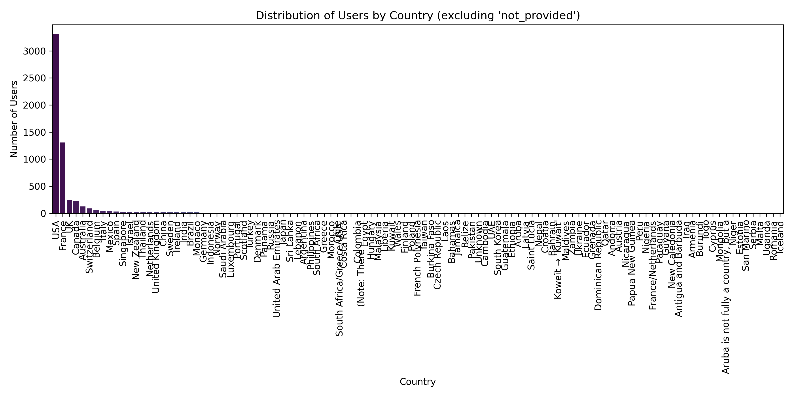

# TripAdvisor Restaurant Review Scraper - Los Angeles 🇺🇸

This project leverages web scraping techniques to analyze user reviews from the top 500 restaurants in **Los Angeles** on **TripAdvisor**. The goal is to extract the **nationalities of users** posting reviews, identify their origin, and provide insights into the most active nationalities engaging with the local restaurant scene.

> This project has strong marketing potential, offering valuable insights to restaurateurs and marketers interested in audience profiling and personalized strategies.

---

## Features

- Scrapes top 500 restaurants from TripAdvisor
- Extracts and saves user reviews, names, and locations
- Uses AI (LLaMA via Groq API) to identify user nationalities
- Handles dynamic content and anti-scraping protections
- Visualizes nationality data using histograms and bar charts
- Supports fault tolerance with scraping resume features

---

## Technologies Used

| Tool | Purpose |
|------|---------|
|  **Python** | Main programming language |
|  **BeautifulSoup** | HTML parsing and content extraction |
|  **Selenium** | Simulated browsing and dynamic content handling |
|  **Google Colab** | Run scraping in the cloud to avoid IP blocks |
|  **Pandas** | Data cleaning, merging, and organization |
|  /  **Matplotlib / Seaborn** | Data visualization (histograms, bar plots) |
|  +  **Groq API + LLaMA LLM** | AI-based country detection from user locations |

---

## Scraping Strategy

- Simulated human browsing with Selenium (clicks, delays, etc.)
- Randomized User-Agent rotation
- Periodic saving of progress (last page, last restaurant)
- Automated detection of countries using LLaMA
- Fault-tolerant: resumes from last saved state if interrupted

---

## Project Structure
├── .env # API keys & configurations
├── cache.json # Caching to avoid redundant queries
├── ColabNotbook.ipynb # Jupyter Notebook for running on Google Colab
├── Execute.py # Main script to launch scraping
├── Scraper_Functions.py # Python functions for scraping logic
├── NationalityClassement.ipynb # Analysis of nationalities
├── last_page.txt # Last page scraped
├── last_restaurant.txt # Last restaurant scraped
├── last_processed.txt # Last user processed
├── Restaurants.csv # Extracted restaurant data
├── user.csv # Extracted user data
├── country_histogram.png # Nationality histogram
├── country_histogram_grouped.png # Grouped nationality histogram
└── WebAnalysisReport.pdf # PDF report with scraping methodology


---

## Sample Result: Country Distribution



---

## Key Insights

- 🇺🇸 **USA** dominates with over 3000 reviews — local customer base
- 🇫🇷 **France** follows with 1000+ — strong francophone/tourism presence
- 🇨🇦🇪🇸🇧🇪🇨🇭 Notable contributions from Canada, Spain, Belgium, and Switzerland
- Long-tail of diverse countries — showcasing LA’s international appeal

---

## Applications

- **Marketing & Advertising**: Tailor campaigns based on user origin
- **Restaurant Strategy**: Customize menus, languages, and services for key nationalities
- **Tourism Insights**: Understand global engagement with LA's food scene

---

## Run the Project

```bash
# Install dependencies
pip install -r requirements.txt

# navigate to Scrap_data
cd scrap_data

# Launch the scraper
python Execute.py
```


## API Used
Groq API with LLaMA LLM

## Authors
Hamza – AI & Big Data engineer
Feel free to reach out for collaborations or insights!
